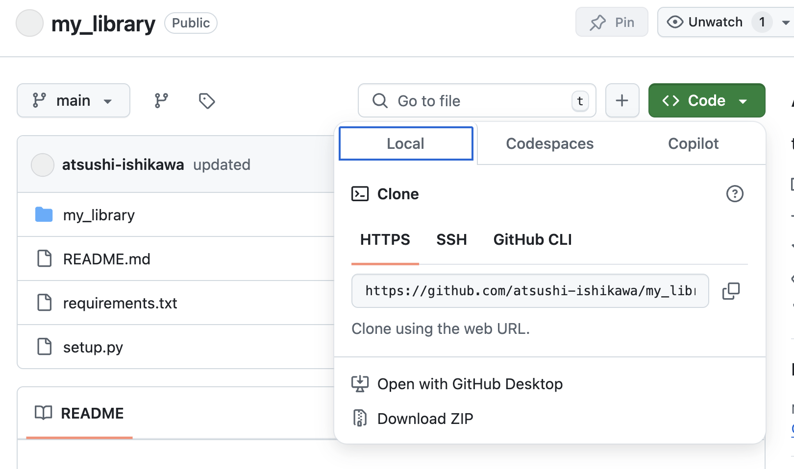

# Making your own Python library
* In this page, we will learn how to make a Python library that can be downloaded with `pip`.
* The example here, `my_library`, is a simple Python library that doubles the given value.

## Making library
* The directory strucuture should be like the folllows:
  ```
  my_library/
  ├── my_library/
  │   ├── __init__.py
  │   └── double.py
  ├── pyproject.toml
  └── README.md
  ```

### 1. Python module
* Create `double.py` with the following code:

```python
import numpy as np

def double(x):
    return np.array(x) * 2
```

### 2. `__init__.py`
* This can be an empty file, so can be made with `touch my_library/__init__.py`

### 3. `pyproject.toml`
* This file contains the package information.
```toml
[build-system]
requires = ["setuptools"]
build-backend = "setuptools.build_meta"

[project]
name = "my_library"
version = "0.0.1"
dependencies = ["numpy"]
```

### 4. `README.md`
* You can write anything on this file. Empty is OK.

## Upload to GitHub
* Create a GitHub repository and upload the code using the following commands:

```sh
git init
git add .
git commit -m "Initial commit"
git branch -M main
git remote add origin https://github.com/YOUR_USERNAME/my_library.git
git push -u origin main
```
* Or you can use browser to make GitHub repository.
* To push or download the file, the URL should be copied on browser.

<div align=center>

</div>

## Install the Library
* You can install the library directly from GitHub using pip:
```sh
pip install git+https://github.com/YOUR_USERNAME/my_library.git
```

## Use your library
* You can use the library in a Python script or interactive environment as follows:

```python
from my_library.double import double

print(double(5))  # Output: 10
print(double([1, 2, 3]))  # Output: [ 2  4  6 ]
```

---

# Additional information

## Package dependence
* When you are using some other libraries in your own-library, these libraries should be installed.
* This dependence is controlled in either way:
  1. `install_requires` in `setup.py`
  2. `requirements.txt`
* In the above example, we took 1. But if you want the exact match of your library version, method 2 is better.
* In this way, you prepare the file `requirements.txt` in the library top directory, and write like
  ```
  numpy
  scipy
  pandas
  ```
* Then use `pip install -r requirements.txt` when you download your own-written library.

## Updating the Package
* You can update your code, upload to GitHub, and download via `pip`.
1. Edit your code
2. Then upload to the main branch: `git add; git commit -m "some message"; git push`
3. Install again
  ```sh
  pip install git+your_repository_url
  ```

## Using your own library with other libraries
* In `setup.py`, include
  ```
  install_requires=[
      "numpy",
      "git+https://github.com/username/my_package.git@main"
  ],
  ```